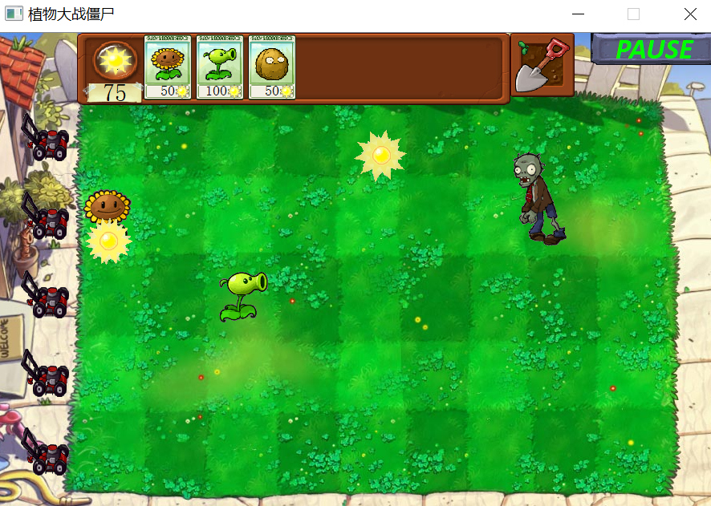

# 植物大战僵尸

## 实验目标

使用`C++`实现植物大战僵尸的`GUI`版本。

> 教程版本只实现了：
>
> 植物类：豌豆射手、向日葵、坚果强；僵尸类：普通僵尸、路障僵尸

## 设计思路

### 架构设计

采用`Qt`的`Graphics View`框架，`Graphics View`框架提供了一个用于管理和交互大量定制的图形项`Item`的场景`Scene`，和一个用于可视化这些图形项`Item`的视图`View`。

自定义的类体现封装、继承、多态的`OOP`思想，继承`QGraphicsItem`，分成三类：

1. 植物基类`Plant`，派生类包括向日葵`SunFlower`、豌豆射手`Peashooter`等。
2. 僵尸基类`Zombie`，派生类包括普通僵尸`BasicZombie`、路障僵尸`ConeZombie`等。
3. 其他基类`Other`，派生类包括商店`Shop`、地图`Map`、卡牌`Card`等。

]

界面仿照原版植物大战僵尸，最上方是卡牌商店，商店右边是铲子，右上角是暂停继续按钮，界面中央是地图，植物和僵尸在此展开战斗，地图左边是割草机。

界面中的静态物体通过绘制`PNG`图片实现，动态物体通过绘制`GIF`图片的每一帧实现。

]

### Graphics View

`Graphics View`提供了一种基于`Item`的`Model-View`编程，多个`View`可以观察单个`Scene`，`Scene`中包含不同几何形状的`Item`。

`QGraphicsScene`提供了`Graphic View`的场景，场景有以下职责：

- 提供一个高性能的接口来管理大量的`Items`
- 将事件传播到每个`Item`
- 管理`Item`状态，如选择和焦点处理
- 提供未被变换的渲染能力，主要用于打印

`Scene`作为`QGraphicsItem`对象的容器，通过调用`addItem()`将`Item`添加到 `Scene`中。还有许多`Item`查找函数，`items()`有多个重载版本，可以返回返回由点、矩形、多边形或向量路径包含或相交的所有`Items`。

`QGraphicsView`提供了`View`组件，用于可视化场景中的内容。视图可以从键盘和鼠标接收事件，并将这些事件转换为场景事件（同时将坐标转换为场景坐标），然后将其发送给场景。

`QGraphicsItem`是场景中图形项`Item`的基类，支持以下功能：

- 鼠标按下，移动，释放和双击事件
- 键盘输入焦点和按键事件
- 拖放
- 碰撞检测

`Item`有许多重要函数，`boundingRect()`返回图形项的边界矩形，`paint()`用于绘制图形，为了实现碰撞检测，可以重写`shape()`返回的`Item`形状，或者重写`collidesWith()`实现自定义碰撞检测。

框架详解：https://blog.csdn.net/kenfan1647/article/details/116991074

到官网上看以下两个案例，分别是碰撞和拖放（重点看碰撞小鼠）：

https://doc.qt.io/qt-6/qtwidgets-graphicsview-collidingmice-example.html

https://doc.qt.io/qt-6/qtwidgets-graphicsview-dragdroprobot-example.html

### 环境准备

建立工程，new -> Qt Widgets Application ，一路`下一步`，mainwindow.ui可以划掉。

在pro文件中添加multimedia模块

```cpp
QT += core gui multimedia
```

将images文件夹和Grazy Dave.wav文件移动到项目目录下，项目中添加资源文件images.qrc和music.qrc，分别添加项目所需的文件和背景音乐。

> 右击项目名，add new... -> Qt -> Qt Resource File -> 命名为images，再右击images.qrc，选择添加现有文件，选择images文件夹下所需文件，yes to all；Grazy Dave.wav文件添加同理

### 代码

#### 1. 植物类

首先是Plant类，Headers中添加plant.h，这里继承QGraphicsItem，参考官网碰撞小鼠案例。编写自定义图形项时，必须实现QGraphicsItem的两个纯虚公共函数：boundingRect()，返回对项目绘制区域的估计，以及paint()，实现实际绘制。另外，我们可能实现了shape ()和advance ()。shape() 默认实现返回项目的边界矩形。advance ()用 来处理动画，所以这一切都发生在一次更新中。

此外，collidesWithPath函数图形项与路径碰撞检测。碰撞由模式决定。如果图形项与该路径相交或包含，则发送碰撞。

QMovie类是适用QImageReader播放电影的便捷类。

`int type()`以int形式返回图形项的类型。所有标准的图形项类都与一个唯一值相关联。qgraphicsitem_cast()使用此类型信息来区分类型。默认实现返回UserType。

`plant.h`

```cpp
#include <QGraphicsScene>
#include <QGraphicsItem>
#include <QPainter>
#include <QMovie>

class Plant : public QGraphicsItem
{
public:
    int hp;
    int state;
    enum { Type = UserType + 1 };
    Plant();
    ~Plant();
    QRectF boundingRect() const override;
    void paint(QPainter *painter, const QStyleOptionGraphicsItem *option, QWidget *widget ) override;
    bool collidesWithItem(const QGraphicsItem *other, Qt::ItemSelectionMode mode) const override;
    int type() const override;
    void setMovie(QString path);

protected:
    QMovie *movie;
    int atk;
    int counter;
    int time;
};
```

植物的属性包括：

- 生命值`hp`，用于判定死亡
- 状态`state`，用于记录状态
- 攻击力`atk`，用于造成伤害
- 计数器`counter`，用于计时
- 时间间隔`time`，用于判定是否行动
- 动画`movie`，用于加载`GIF`

植物的函数包括：

- `boundingRect()`，返回植物的边界矩形
- `paint()`，绘制植物
- `collidesWithItem()`，判定是否碰撞
- `advance()`，根据计数器和状态，进行碰撞检测，完成行动和状态转移
- `setMovie()`，设置动画的方便接口


#### 2. 僵尸类

接下来添加zombie.h，原理同上

qgraphicsItem_cast＜T＞(QGraphicsItem )函数可以从屏幕QGraphicsScene中抓取任意一个区域中想要抓取的Item项。

`zombie.h`

```cpp
#include <QGraphicsScene>
#include <QGraphicsItem>
#include <QPainter>
#include <QMovie>

class Zombie : public QGraphicsItem
{
public:
    int hp;
    int atk;
    int state;
    qreal speed;
    enum { Type = UserType + 2};
    Zombie();
    ~Zombie() override;
    QRectF boundingRect() const override;
    void paint(QPainter *painter, const QStyleOptionGraphicsItem *option, QWidget *widget) override;
    bool collidesWithItem(const QGraphicsItem *other, Qt::ItemSelectionMode mode) const override;
    int type() const override;
    void setMovie(QString path);
    void setHead(QString path);
protected:
    QMovie *movie;
    QMovie *head;
};
```

僵尸的属性包括：

- 生命值`hp`，用于判定死亡
- 状态`state`，用于记录状态
- 攻击力`atk`，用于造成伤害
- 速度`speed`，用于移动
- 动画`movie`，用于绘制`GIF`
- 动态`head`，用于绘制死亡僵尸头部`GIF`

僵尸的函数包括：

- `boundingRect()`，返回僵尸的边界矩形
- `paint()`，绘制僵尸
- `collidesWithItem()`，判定是否碰撞
- `advance()`，根据状态，进行碰撞检测，完成行动和状态转移
- `setMovie()`，设置动画的方便接口


#### 3. 其他类

最后是other.h，用于其他类的设计

`other.h`

```cpp
#include <QGraphicsItem>
#include <QtWidgets>
#include <QPainter>

class Other : public QGraphicsItem
{
public:
    enum { Type = UserType + 3};
    Other();
    int type() const override;
};
```


#### 4. 实现基类的cpp文件

接下来在Sources中分别添加并实现plant.cpp、zombie.cpp、other.cpp

`plant.cpp`

```cpp
#include "plant.h"
#include "zombie.h"

Plant::Plant()
{
    movie = nullptr;
    atk = counter = time = 0;
}

Plant::~Plant()
{
    delete movie;
}
// 返回便捷图形
QRectF Plant::boundingRect() const
{
    return QRectF(-35, -35, 70, 70);
}
// 绘制图形
void Plant::paint(QPainter *painter, const QStyleOptionGraphicsItem *option, QWidget *widget)
{
    Q_UNUSED(option); //Q_UNUSED用来避免编译器警告
    Q_UNUSED(widget);
    // 绘制gif的当前帧
    painter->drawImage(boundingRect(), movie->currentImage());
}
// 碰撞检测
bool Plant::collidesWithItem(const QGraphicsItem *other, Qt::ItemSelectionMode mode) const
{
    Q_UNUSED(other);
    Q_UNUSED(mode);
    // 左右30像素内是否存在僵尸
    return other->type() == Zombie::Type 
        && qFuzzyCompare(other->y(), y()) && qAbs(other->x() - x()) < 30;
}

int Plant::type() const
{
    return Type;
}
// 设置gif
void Plant::setMovie(QString path)
{
    if (movie)
        delete movie;
    // 设置gif并播放
    movie = new QMovie(path);
    movie->start();
}
```

`zombie.cpp`

```cpp
#include "zombie.h"
#include "plant.h"

Zombie::Zombie()
{
    movie = head = nullptr;
    hp = atk = state = 0;
    speed = 0.0;
}

Zombie::~Zombie()
{
    delete movie;
    delete head;
}

QRectF Zombie::boundingRect() const
{
    return QRectF(-80, -100, 200, 140);
}

void Zombie::paint(QPainter *painter, const QStyleOptionGraphicsItem *option, QWidget *widget)
{
    Q_UNUSED(option)
    Q_UNUSED(widget)
    QImage image = movie->currentImage();
    if (speed < 0.55 && state != 3)
    {
        if (state != 2)
            movie->setSpeed(50);
        int w = image.width();
        int h = image.height();
        // 填充
        for (int i = 0; i < h; ++i)
        {
            uchar *line = image.scanLine(i);
            for (int j = 5; j < w - 5; ++j)
                line[j << 2] = 200;
        }
    }
    painter->drawImage(QRectF(-70, -100, 140, 140), image);
    if (head)
    {
        image = head->currentImage();
        if (speed < 0.55)
        {
            int w = image.width();
            int h = image.height();
            for (int i = 0; i < h; ++i)
            {
                uchar *line = image.scanLine(i);
                for (int j = 5; j < w - 5; ++j)
                    line[j << 2] = 200;
            }
        }
        painter->drawImage(QRectF(0, -100, 140, 140), image);
    }
}

bool Zombie::collidesWithItem(const QGraphicsItem *other, Qt::ItemSelectionMode mode) const
{
    Q_UNUSED(mode)
    return other->type() == Plant::Type && qFuzzyCompare(other->y(), y()) && qAbs(other->x() - x()) < 30;
}

int Zombie::type() const
{
    return Type;
}

void Zombie::setMovie(QString path)
{
    if (movie)
        delete movie;
    movie = new QMovie(path);
    movie->start();
}

void Zombie::setHead(QString path)
{
    if (head)
        delete head;
    head = new QMovie(path);
    head->start();
}
```

`other.cpp`

```cpp
#include "other.h"

Other::Other()
{

}

int Other::type() const
{
    return Type;
}
```

#### 5. “飞行物”实现

接下来完成other中的pea和sun，它们都属于Other类

我们重新实现了advance () 来处理动画，所以这一切都发生在一次更新中。当QGraphicsScene决定将场景推进一帧时，它将在每个项目上调用QGraphicsItem::advance ()。这使我们能够使用我们重新实现的 advance() 函数来为我们的鼠标设置动画。

`pea.h`

```cpp
#include "other.h"

class Pea : public Other
{
public:
    Pea(int attack = 0);
    QRectF boundingRect() const override;
    void paint(QPainter *painter, const QStyleOptionGraphicsItem *option, QWidget *widget) override;
    bool collidesWithItem(const QGraphicsItem *other, Qt::ItemSelectionMode mode) const override;
    void advance(int phase) override;
private:
    int atk;
    qreal speed;
};
```

`pea.cpp`

```cpp
#include "pea.h"
#include "zombie.h"

Pea::Pea(int attack)
{
    atk = attack;
    speed = 360.0 * 33 / 1000;
}

QRectF Pea::boundingRect() const
{
    return QRectF(-12, -28, 24, 24);
}

void Pea::paint(QPainter *painter, const QStyleOptionGraphicsItem *option, QWidget *widget)
{
    Q_UNUSED(option)
    Q_UNUSED(widget)
    painter->drawPixmap(QRect(-12, -28, 24, 24), QPixmap(":/images/Pea.png"));
}

bool Pea::collidesWithItem(const QGraphicsItem *other, Qt::ItemSelectionMode mode) const
{
    Q_UNUSED(mode);
    return other->type() == Zombie::Type && qFuzzyCompare(other->y(), y()) && qAbs(other->x() - x()) < 15;
}

void Pea::advance(int phase)
{
    if (!phase)
        return;
    update(); //刷新控件整个区域
    QList<QGraphicsItem *> items = collidingItems();
    if (!items.isEmpty())
    {
        Zombie *zombie = qgraphicsitem_cast<Zombie *>(items[qrand() % items.size()]);
        zombie->hp -= atk;
        delete this;
        return;
    }
    setX(x() + speed);
    if (x() > 1069)
        delete this;
}
```

`sun.h`

```cpp
#include "other.h"

class Sun : public Other
{
public:
    Sun();
    Sun(QPointF pos);
    ~Sun() override;
    QRectF boundingRect() const override;
    void paint(QPainter *painter, const QStyleOptionGraphicsItem *option, QWidget *widget) override;
    void mousePressEvent(QGraphicsSceneMouseEvent *event) override; //鼠标按下事件
    void advance(int phase) override;
private:
    QMovie *movie;
    QPointF dest;
    int counter;
    int time;
    qreal speed;
};
```

`sun.cpp`

```cpp
// 这里暂时不考虑mouseclick事件
#include "shop.h"

Sun::Sun()
{
    dest = QPointF(290 + qrand() % (82 * 7), 130 + qrand() % (98 * 5));
    setPos(QPointF(dest.x(), 70));
    speed = 60.0 * 50 / 1000;
    counter = 0;
    time = int(10.0 * 1000 / 33);
    movie = new QMovie(":/images/Sun.gif");
    movie->start();
    setAcceptedMouseButtons(Qt::LeftButton);// 设置接受鼠标事件的鼠标按键（左键）
}

Sun::Sun(QPointF pos)
{
    dest = QPointF(pos.x() + qrand() % 30 - 15, pos.y() + qrand() % 30 + 15);
    setPos(QPointF(dest.x(), pos.y()));
    speed = 60 * 50 / 1000;
    counter = 0;
    time = int(10.0 * 1000 / 33);
    movie = new QMovie(":/images/Sun.gif");
    movie->start();
    setAcceptedMouseButtons(Qt::LeftButton);
}

Sun::~Sun()
{
    if (movie)
        delete movie;
}

QRectF Sun::boundingRect() const
{
    return QRectF(-35, -35, 70, 70);
}

void Sun::paint(QPainter *painter, const QStyleOptionGraphicsItem *option, QWidget *widget)
{
    Q_UNUSED(option)
    Q_UNUSED(widget)
    painter->drawImage(boundingRect(), movie->currentImage());
}

void Sun::advance(int phase)
{
    if (!phase)
        return;
    update();
    if (++counter >= time)
        delete this;
    else if (y() < dest.y())
        setY(y() + speed);
}
```

#### 6. 豌豆射手

`peashooter.h`

```cpp
#include "plant.h"
#include "zombie.h"
#include "pea.h"

class Peashooter : public Plant
{
public:
    Peashooter();
    void  advance(int phase) override;
    bool collidesWithItem(const QGraphicsItem *other, Qt::ItemSelectionMode mode) const override;
};
```

`peashooter.cpp`

```cpp
#include "peashooter.h"

Peashooter::Peashooter()
{
    atk = 25;
    hp = 300;
    time = int(1.4 * 1000 / 33);
    setMovie(":/images/Peashooter.gif");
}

void Peashooter::advance(int phase)
{
    if (!phase)
        return;
    // 重绘
    update();
    // 死亡
    if (hp <= 0)
        delete this;
    // 装弹完成
    else if (++counter >= time)
    {
        counter = 0;
        // 检测到有僵尸
        if (!collidingItems().isEmpty())
        {
            // 发射子弹
            Pea *pea = new Pea(atk);
            pea->setX(x() + 32);
            pea->setY(y());
            scene()->addItem(pea);
            return;
        }
    }
}

bool Peashooter::collidesWithItem(const QGraphicsItem *other, Qt::ItemSelectionMode mode) const
{
    Q_UNUSED(mode)
    return other->type() == Zombie::Type && qFuzzyCompare(other->y(), y());
}
```

#### 7. 太阳花

`sunflower.h`

```cpp
#include "plant.h"
#include "sun.h"

class SunFlower : public Plant
{
public:
    SunFlower();
    void advance(int phase) override;
};
```

`sunflower.cpp`

```cpp
#include "sunflower.h"

SunFlower::SunFlower()
{
    hp = 300;
    time = int(10.0 * 1000 / 33);
    setMovie(":/images/SunFlower.gif");
}

void SunFlower::advance(int phase)
{
    if (!phase)
        return;
    update();
    if (hp <= 0)
        delete this;
    // 生产阳光
    else if (++counter >= time)
    {
        counter = 0;
        scene()->addItem(new Sun(pos()));
    }
}
```

#### 8. 坚果强

`wallnut.h`

```cpp
#include "plant.h"

class WallNut : public Plant
{
public:
    WallNut();
    void advance(int phase) override;
};
```

`wallnut.cpp`

```cpp
#include "wallnut.h"

WallNut::WallNut()
{
    hp = 4000;
    setMovie(":/images/WallNut.gif");
}

void WallNut::advance(int phase)
{
    if (!phase)
        return;
    update();
    if (hp <= 0)
        delete this;
    else if (hp <= 1333 && state != 2)
    {
        state = 2;
        setMovie(":/images/WallNut2.gif");
    }
    else if (1333 < hp && hp <= 2667 && state != 1)
    {
        state = 1;
        setMovie(":/images/WallNut1.gif");
    }
}
```

#### 9. 基础僵尸

`basiczombie.h`

```cpp
#include "zombie.h"
#include "plant.h"

class BasicZombie : public Zombie
{
public:
    BasicZombie();
    void advance(int phase) override;
};
```

`basiczombie.cpp`

```cpp
#include "basiczombie.h"

BasicZombie::BasicZombie()
{
    hp = 270;
    atk = 100 * 33 / 1000;
    speed = 80.0 * 33 / 1000 / 4.7;
    if (qrand() % 2)
        setMovie(":/images/ZombieWalk1.gif");
    else
        setMovie(":/images/ZombieWalk2.gif");
}

void BasicZombie::advance(int phase)
{
    if (!phase)
        return;
    update();
    if (hp <= 0)
    {
        // 播放死亡动画
        if (state < 2)
        {
            state = 2;
            setMovie(":/images/ZombieDie.gif");
            setHead(":/images/ZombieHead.gif");
        }
        // 死亡动画播放结束
        else if (movie->currentFrameNumber() == movie->frameCount() - 1)
            delete this;
        return;
    }
    QList<QGraphicsItem *> items = collidingItems();
    if (!items.isEmpty())
    {
        // 攻击植物
        Plant *plant = qgraphicsitem_cast<Plant *>(items[0]);
        plant->hp -= atk;
        // 播放攻击动画
        if (state != 1)
        {
            state = 1;
            setMovie(":/images/ZombieAttack.gif");
        }
        return;
    }
    if (state)
    {
        state = 0;
        if (qrand() % 2)
            setMovie(":/images/ZombieWalk1.gif");
        else
            setMovie(":/images/ZombieWalk2.gif");
    }
    setX(x() - speed);// 向前移动
}
```

#### 10. 路障僵尸

`conezombie.h`

```cpp
#include "zombie.h"
#include "plant.h"

class ConeZombie : public Zombie
{
public:
    ConeZombie();
    void advance(int phase) override;
};
```

`conezombie.cpp`

```cpp
ConeZombie::ConeZombie()
{
    hp = 640;
    atk = 100 * 33 / 1000;
    speed = 80.0 * 33 / 1000 / 4.7;
    setMovie(":/images/ConeZombieWalk.gif");
}

void ConeZombie::advance(int phase)
{
    if (!phase)
        return;
    update();
    if (hp <= 0)
    {
        if (state < 2)
        {
            state = 2;
            setMovie(":/images/ZombieDie.gif");
            setHead(":/images/ZombieHead.gif");
        }
        else if (movie->currentFrameNumber() == movie->frameCount() - 1)
            delete this;
        return;
    }
    QList<QGraphicsItem *> items = collidingItems();
    if (!items.isEmpty())
    {
        Plant *plant = qgraphicsitem_cast<Plant *>(items[0]);
        plant->hp -= atk;
        if (state != 1)
        {
            state = 1;
            setMovie(":/images/ConeZombieAttack.gif");
        }
        return;
    }
    if (state)
    {
        state = 0;
        setMovie(":/images/ConeZombieWalk.gif");
    }
    setX(x() - speed);
}
```

#### 11. 按钮

`button.h`

```cpp
#include <QTimer>
#include <QSound>
#include "other.h"

class Button : public Other
{
public:
    Button(QSound *s, QTimer *t);
    QRectF boundingRect() const override;
    void paint(QPainter *painter, const QStyleOptionGraphicsItem *option, QWidget *widget) override;
    void mousePressEvent(QGraphicsSceneMouseEvent *event) override;
private:
    QSound *sound;
    QTimer *timer;
};
```

`button.cpp`

```cpp
#include "button.h"

Button::Button(QSound *s, QTimer *t)
{
    sound = s;
    timer = t;
}

QRectF Button::boundingRect() const
{
    return QRectF(-80, -20, 160, 40);
}

void Button::paint(QPainter *painter, const QStyleOptionGraphicsItem *option, QWidget *widget)
{
    Q_UNUSED(option)
    Q_UNUSED(widget)
    painter->drawPixmap(QRect(-80, -20, 160, 40), QPixmap(":/images/Button.png"));
    painter->setPen(Qt::green);
    QFont font("Calibri", 18, QFont::Bold, true);
    painter->setFont(font);
    if (timer->isActive())
        painter->drawText(boundingRect(), Qt::AlignCenter, "PAUSE");
    else
        painter->drawText(boundingRect(), Qt::AlignCenter, "CONTINUE");
}

void Button::mousePressEvent(QGraphicsSceneMouseEvent *event)
{
    // 鼠标左键
    if (event->button() == Qt::LeftButton)
    {
        if (timer->isActive())
        {
            sound->stop();
            timer->stop();
        }
        else
        {
            sound->play();
            timer->start();
        }
    }
    update();
}
```

#### 12. 割草机

`mower.h`

```cpp
#include "other.h"
#include "zombie.h"

class Mower : public Other
{
public:
    Mower();
    QRectF boundingRect() const override;
    void paint(QPainter *painter, const QStyleOptionGraphicsItem *option, QWidget *widget) override;
    bool collidesWithItem(const QGraphicsItem *other, Qt::ItemSelectionMode mode) const override;
    void advance(int phase) override;
private:
    bool flag;
    qreal speed;
};
```

`mower.cpp`

```cpp
#include "mower.h"

Mower::Mower()
{
    flag = false;
    speed = 270.0 * 33 / 1000;
}

QRectF Mower::boundingRect() const
{
    return QRectF(-30, -30, 60, 60);
}

void Mower::paint(QPainter *painter, const QStyleOptionGraphicsItem *option, QWidget *widget)
{
    Q_UNUSED(option)
    Q_UNUSED(widget)
    painter->drawPixmap(QRect(-30, -30, 60, 60), QPixmap(":/images/LawnMower.png"));
}

bool Mower::collidesWithItem(const QGraphicsItem *other, Qt::ItemSelectionMode mode) const
{
    Q_UNUSED(mode)
    return other->type() == Zombie::Type && qFuzzyCompare(other->y(), y()) && qAbs(other->x() - x()) < 15;
}

void Mower::advance(int phase)
{
    if (!phase)
        return;
    update();
    QList<QGraphicsItem *> items = collidingItems();
    if (!items.empty())
    {
        flag = true;
        foreach (QGraphicsItem *item, items)
        {
            Zombie *zombie = qgraphicsitem_cast<Zombie *>(item);
            zombie->hp = 0;
        }
    }
    if (flag)
        setX(x() + speed);
    if (x() > 1069)
        delete this;
}
```

#### 13. 铁铲

`shovel.h`

```cpp
#include "other.h"
#include "plant.h"

class Shovel : public Other
{
public:
    Shovel();
    QRectF boundingRect() const override;
    void paint(QPainter *painter, const QStyleOptionGraphicsItem *option, QWidget *widget) override;
    void mousePressEvent(QGraphicsSceneMouseEvent *event) override;
    void mouseMoveEvent(QGraphicsSceneMouseEvent *event) override;
    void mouseReleaseEvent(QGraphicsSceneMouseEvent *event) override;
    void removePlant(QPointF pos);
};
```

`shovel.cpp`

```cpp
#include "shovel.h"

Shovel::Shovel()
{

}

QRectF Shovel::boundingRect() const
{
    return QRectF(-40, -40, 80, 80);
}

void Shovel::paint(QPainter *painter, const QStyleOptionGraphicsItem *option, QWidget *widget)
{
    Q_UNUSED(option)
    Q_UNUSED(widget)
    painter->drawPixmap(QRect(-40, -40, 80, 80), QPixmap(":/images/ShovelBank.png"));
    painter->drawPixmap(QRect(-35, -35, 70, 70), QPixmap(":/images/Shovel.png"));
}

void Shovel::mousePressEvent(QGraphicsSceneMouseEvent *event)
{
    Q_UNUSED(event)
    setCursor(Qt::ArrowCursor);
}

void Shovel::mouseMoveEvent(QGraphicsSceneMouseEvent *event)
{
    if (QLineF(event->screenPos(), event->buttonDownScreenPos(Qt::LeftButton)).length()
            < QApplication::startDragDistance())
        return;
    QDrag *drag = new QDrag(event->widget());
    QMimeData *mime = new QMimeData;
    QImage image(":/images/Shovel.png");
    mime->setText("Shovel");
    mime->setImageData(image);
    drag->setMimeData(mime);
    drag->setPixmap(QPixmap::fromImage(image).scaled(70, 70));
    drag->setHotSpot(QPoint(35, 35));
    drag->exec();
    setCursor(Qt::ArrowCursor);
}

void Shovel::mouseReleaseEvent(QGraphicsSceneMouseEvent *event)
{
    Q_UNUSED(event)
    setCursor(Qt::ArrowCursor);
}

void Shovel::removePlant(QPointF pos)
{
    QList<QGraphicsItem *> items = scene()->items(pos);
    foreach (QGraphicsItem *item, items)
        if (item->type() == Plant::Type)
        {
            delete item;
            return;
        }
}
```

#### 14. 卡牌

`card.h`

```cpp
#include "other.h"

class Card : public Other
{
public:
    int counter;
    QString text;
    Card(QString s);
    const static QMap<QString, int> map;
    const static QVector<QString> name;
    const static QVector<int> cost;
    const static QVector<int> cool;
    QRectF boundingRect() const override;
    void paint(QPainter *painter, const QStyleOptionGraphicsItem *option, QWidget *widget) override;
    void advance(int phase) override;
    void mousePressEvent(QGraphicsSceneMouseEvent *event) override;
    void mouseMoveEvent(QGraphicsSceneMouseEvent *event) override;
    void mouseReleaseEvent(QGraphicsSceneMouseEvent *event) override;
};
```

`card.cpp`

```cpp
#include "card.h"
#include "shop.h"

const QMap<QString, int> Card::map = {{"SunFlower", 0}, {"Peashooter", 1},  {"WallNut", 2}};
const QVector<QString> Card::name = {"SunFlower", "Peashooter", "WallNut",};
const QVector<int> Card::cost = {50, 100, 50};
const QVector<int> Card::cool = {227, 227, 606};

Card::Card(QString s)
{
    text = s;
    counter = 0;
}

QRectF Card::boundingRect() const
{
    return QRectF(-50, -30, 100, 60);
}

void Card::paint(QPainter *painter, const QStyleOptionGraphicsItem *option, QWidget *widget)
{
    Q_UNUSED(option)
    Q_UNUSED(widget)
    painter->scale(0.6, 0.58);
    painter->drawPixmap(QRect(-50, -70, 100, 140), QPixmap(":/images/Card.png"));
    painter->drawPixmap(QRect(-35, -42, 70, 70), QPixmap(":/images/" + text + ".png"));
    QFont font;
    font.setPointSizeF(15);
    painter->setFont(font);
    painter->drawText(-30, 60, QString().sprintf("%3d", cost[map[text]]));
    // 冷却未完成卡牌要变黑，可以根据已冷却时间在卡牌上画黑色矩形
    if (counter < cool[map[text]])
    {
        // 透明度为200
        QBrush brush(QColor(0, 0, 0, 200));
        painter->setBrush(brush);
        // 根据冷却时间计算黑色矩形高度
        painter->drawRect(QRectF(-48, -68, 98, 132 * (1 - qreal(counter) / cool[map[text]])));
    }
}

void Card::advance(int phase)
{
    if (!phase)
        return;
    update();
    if (counter < cool[map[text]])
        ++counter;
}

void Card::mousePressEvent(QGraphicsSceneMouseEvent *event)
{
    Q_UNUSED(event)
    if (counter < cool[map[text]])
        event->setAccepted(false);
    Shop *shop = qgraphicsitem_cast<Shop *>(parentItem());
    if (cost[map[text]] > shop->sun)
        event->setAccepted(false);
    setCursor(Qt::ArrowCursor);
}
// 鼠标移动事件
void Card::mouseMoveEvent(QGraphicsSceneMouseEvent *event)
{
    // 小于最小移动距离
    if (QLineF(event->screenPos(), event->buttonDownScreenPos(Qt::LeftButton)).length()
            < QApplication::startDragDistance())
        return;
    // 传递拖放数据
    QDrag *drag = new QDrag(event->widget());
    QMimeData *mime = new QMimeData;
    QImage image(":/images/" + text + ".png");
    mime->setText(text);
    mime->setImageData(image);
    drag->setMimeData(mime);
    drag->setPixmap(QPixmap::fromImage(image));
    drag->setHotSpot(QPoint(35, 35));
    drag->exec();
    setCursor(Qt::ArrowCursor);
}

void Card::mouseReleaseEvent(QGraphicsSceneMouseEvent *event)
{
    Q_UNUSED(event)
    setCursor(Qt::ArrowCursor);
}
```

#### 15. 商店

`shop.h`

```cpp
#include "plant.h"
#include "other.h"
#include "card.h"
#include "sun.h"
#include "sunflower.h"
#include "peashooter.h"
#include "wallnut.h"
#include "basiczombie.h"

class Shop : public Other
{
public:
    int sun;
    Shop();
    QRectF boundingRect() const override;
    void paint(QPainter *painter, const QStyleOptionGraphicsItem *option, QWidget *widget) override;
    void advance(int phase) override;
    void addPlant(QString s, QPointF pos);
private:
    int counter;
    int time;
};
```

`shop.cpp`

```cpp
#include "shop.h"

Shop::Shop()
{
    sun = 200;
    counter = 0;
    time = int(7.0 * 1000 / 33);
    Card *card = nullptr;
    for (int i = 0; i < Card::name.size(); ++i)
    {
        card = new Card(Card::name[i]);
        card->setParentItem(this);
        card->setPos(-157 + 65 * i, -2);
    }
}

QRectF Shop::boundingRect() const
{
    return QRectF(-270, -45, 540, 90);
}

void Shop::paint(QPainter *painter, const QStyleOptionGraphicsItem *option, QWidget *widget)
{
    Q_UNUSED(option)
    Q_UNUSED(widget)
    painter->drawPixmap(QRect(-270, -45, 540, 90), QPixmap(":/images/Shop.png"));
    QFont font;
    font.setPointSizeF(15);
    painter->setFont(font);
    painter->drawText(QRectF(-255, 18, 65, 22), Qt::AlignCenter, QString::number(sun));
    painter->drawPoint(-220, 0);
}

void Shop::advance(int phase)
{
    if (!phase)
        return;
    update();
    if (++counter >= time)
    {
        counter = 0;
        scene()->addItem(new Sun);
    }
}

void Shop::addPlant(QString s, QPointF pos)
{
    QList<QGraphicsItem *> items = scene()->items(pos);
    foreach (QGraphicsItem *item, items)
        if (item->type() == Plant::Type)
            return;
    sun -= Card::cost[Card::map[s]];
    Plant *plant = nullptr;
    switch (Card::map[s])
    {
    case 0:
        plant = new SunFlower; break;
    case 1:
        plant = new Peashooter; break;
    case 2:
        plant = new WallNut; break;
    }
    plant->setPos(pos);
    scene()->addItem(plant);
    QList<QGraphicsItem *> child = childItems();
    foreach (QGraphicsItem *item, child)
    {
        Card *card = qgraphicsitem_cast<Card *>(item);
        if (card->text == s)
            card->counter = 0;
    }
    counter = 0;
}
```

之前在实现sun.cpp时没有考虑mouseclick事件，在此对`sun.cpp`进行修改

> `T qgraphicsitem_cast(QGraphicsItem *item)`：（类型转换）如果图形项为T类型，则返回给定的类型T类型的图形项；否则返回nullptr。自定义图形项要正常使用此函数必须重新实现type()函数。

```cpp
// sun.cpp
#include "shop.h" // 添加shop.h头文件

// mouseclick事件
void Sun::mousePressEvent(QGraphicsSceneMouseEvent *event)
{
    Q_UNUSED(event)
    Shop *shop = qgraphicsitem_cast<Shop *>(scene()->items(QPointF(300, 15))[0]);
    shop->sun += 25;
    counter = time;
    event->setAccepted(true);
}
```

#### 16. 地图

`Map`需要处理拖放事件，执行种植或铲除。

`map.h`

```cpp
#include "other.h"
#include "plant.h"
#include "shop.h"
#include "shovel.h"
#include <QGraphicsSceneDragDropEvent>

class Map : public Other
{
public:
    Map();
    QRectF boundingRect() const override;
    void paint(QPainter *painter, const QStyleOptionGraphicsItem *option, QWidget *widget) override;
    void dragEnterEvent(QGraphicsSceneDragDropEvent *event) override;
    void dragLeaveEvent(QGraphicsSceneDragDropEvent *event) override;
    void dropEvent(QGraphicsSceneDragDropEvent *event) override;
private:
    bool dragOver;
};
```

`map.cpp`

```cpp
#include "map.h"

Map::Map()
{
    dragOver = false;
    setAcceptDrops(true);
}

QRectF Map::boundingRect() const
{
    return QRectF(-369, -235, 738, 470);
}

void Map::paint(QPainter *painter, const QStyleOptionGraphicsItem *option, QWidget *widget)
{
    Q_UNUSED(painter)
    Q_UNUSED(option)
    Q_UNUSED(widget)
    // painter->setPen(Qt::black);
    // painter->drawRect(boundingRect());
}

void Map::dragEnterEvent(QGraphicsSceneDragDropEvent *event)
{
    if (event->mimeData()->hasText())
    {
        event->setAccepted(true);
        dragOver = true;
        update();
    }
    else
        event->setAccepted(false);
}

void Map::dragLeaveEvent(QGraphicsSceneDragDropEvent *event)
{
    Q_UNUSED(event);
    dragOver = false;
    update();
}

void Map::dropEvent(QGraphicsSceneDragDropEvent *event)
{
    dragOver = false;
    if (event->mimeData()->hasText())
    {
        QString s = event->mimeData()->text();
        QPointF pos = mapToScene(event->pos());
        pos.setX((int(pos.x()) - 249) / 82 * 82 + 290);
        pos.setY((int(pos.y()) - 81) / 98 * 98 + 130);
        if (s == "Shovel")
        {
            Shovel *shovel = qgraphicsitem_cast<Shovel *>(scene()->items(QPointF(830, 15))[0]);
            shovel->removePlant(pos);
        }
        else
        {
            Shop *shop = qgraphicsitem_cast<Shop *>(scene()->items(QPointF(300, 15))[0]);
            shop->addPlant(s, pos);
        }
    }
    update();
}
```


### 主窗口设计

`MainWindow`控制整个游戏的运行，具体流程为：

1. 播放背景音乐
2. 创建场景，设置边界
3. 创建商店、卡牌、铲子、地图、割草机，加入场景
4. 创建视图，设置背景和大小
5. 创建计时器，将计时器事件`timeout()`绑定到场景`advance()`
6. 将计时器事件绑定到僵尸生成函数`addZombie()`和胜负判断函数`check()`

`mainwindow.h`

```cpp
#include <QMainWindow>
#include <QGraphicsScene>
#include <QGraphicsView>
#include <QSound>
#include <QTimer>
#include "shop.h"
#include "card.h"
#include "shovel.h"
#include "map.h"
#include "mower.h"
#include "basiczombie.h"
#include "conezombie.h"
#include "button.h"

class MainWindow : public QMainWindow
{
    Q_OBJECT
public:
    explicit MainWindow(QWidget *parent = nullptr);
    ~MainWindow() override;
    void addZombie();
    void check();

private:
    QSound *sound;
    QTimer *timer;
    QGraphicsScene *scene;
    QGraphicsView *view;
};
```

`mainwindow.cpp`

```cpp
#include "mainwindow.h"

MainWindow::MainWindow(QWidget *parent) : QMainWindow(parent)
{
    qsrand(uint(QTime(0, 0, 0).secsTo(QTime::currentTime())));
    sound = new QSound(":/Grazy Dave.wav");
    sound->setLoops(QSound::Infinite);
    timer = new QTimer;
    scene = new QGraphicsScene(this);
    scene->setSceneRect(150, 0, 900, 600);
    scene->setItemIndexMethod(QGraphicsScene::NoIndex);
    Shop *shop = new Shop;
    shop->setPos(520, 45);
    scene->addItem(shop);
    Shovel *shovel = new Shovel;
    shovel->setPos(830, 40);
    scene->addItem(shovel);
    Button *button = new Button(sound, timer);
    button->setPos(970, 20);
    scene->addItem(button);
    Map *map = new Map;
    map->setPos(618, 326);
    scene->addItem(map);
    for (int i = 0; i < 5; ++i)
    {
        Mower *mower = new Mower;
        mower->setPos(210, 130 + 98 * i);
        scene->addItem(mower);
    }
    view = new QGraphicsView(scene, this);
    view->resize(902, 602);
    view->setRenderHint(QPainter::Antialiasing);
    view->setBackgroundBrush(QPixmap(":/images/Background.jpg"));
    view->setCacheMode(QGraphicsView::CacheBackground);
    view->setViewportUpdateMode(QGraphicsView::BoundingRectViewportUpdate);
    connect(timer, &QTimer::timeout, scene, &QGraphicsScene::advance);
    connect(timer, &QTimer::timeout, this, &MainWindow::addZombie);
    connect(timer, &QTimer::timeout, this, &MainWindow::check);
    sound->play();
    timer->start(33);
    view->show();
}

MainWindow::~MainWindow()
{
    delete sound;
    delete timer;
    delete scene;
    delete view;
}

void MainWindow::addZombie()
{
    static int low = 4;
    static int high = 8;
    static int maxtime = 20 * 1000 / 33;
    static int time = maxtime / 2;
    static int counter = 0;
    if (++counter >= time)
    {
        if (++low > high)
        {
            maxtime /= 1.3;
            high *= 2;
        }
        counter = 0;
        time = qrand() % (2 * maxtime / 3) + maxtime / 3;
        int type = qrand() % 100;
        int i = qrand() % 5;
        Zombie *zombie;
        if (type < 70)
            zombie = new BasicZombie;
        else
            zombie = new ConeZombie;
        zombie->setPos(1028, 130 + 98 * i);
        scene->addItem(zombie);
    }
}

void MainWindow::check()
{
    static int time = 1 * 1000 / 33;
    static int counter = 0;
    if (++counter >= time)
    {
        counter = 0;
        const QList<QGraphicsItem *> items = scene->items();
        foreach (QGraphicsItem *item, items)
            if (item->type() == Zombie::Type && item->x() < 200)
            {
                scene->addPixmap(QPixmap(":/images/ZombiesWon.png"))->setPos(336, 92);
                scene->advance();
                timer->stop();
                return;
            }
    }
}
```

`main.cpp`

```cpp
#include "mainwindow.h"

#include <QApplication>

int main(int argc, char *argv[])
{
    QApplication a(argc, argv);
    MainWindow w;
    w.setFixedSize(900, 600);
    w.setWindowTitle("植物大战僵尸");
    w.show();
    return a.exec();
}
```


### 运行与测试

点击运行，效果如下：


